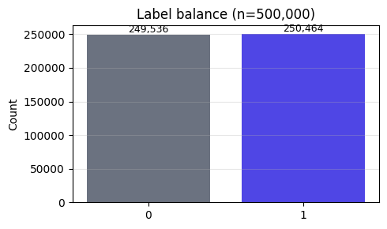

# Large-data workflow

> **Tearsheet** for [`notebooks/large_data.py`](../../notebooks/large_data.py) · [HTML report](../../reports/large_data.html) · last run `2026-04-18T17:00:18+00:00`

Demonstrates the **git-ignore the bulky bits, commit the story** pattern:

- `data/seed.json` — a tiny committed seed controls generation. Edit the
  seed and the downstream cache invalidates.
- `artifacts/large_data/sample_*.parquet` — generated dump, **git-ignored**
  (see [`.gitignore`](../.gitignore)). Reviewers re-run `jellycell run` to
  reproduce it locally; the bytes never hit version control.
- `artifacts/large_data/headline.json` — a small committed digest. Fits
  in the tearsheet as a key/value table so reviewers see the last-run
  stats on GitHub without needing the parquet.

The project has `max_committed_size_mb = 10` set low so the generated
parquet trips the warning at the end of `jellycell run`.

**Config**

```python
# 500k rows × 12 features ≈ 48 MB parquet. Enough to trip the 10 MB
# max_committed_size_mb warning below — dial it up to 5_000_000 for a
# "really big" run, down to 50_000 for a fast smoke test. The downstream
# cache-key tracks this value, so the subgraph re-runs on any change.
N_ROWS = 500_000
N_FEATURES = 12
SEED = 42
```

**Headline**

| field | value |
| --- | --- |
| `rows` | `500000` |
| `features` | `12` |
| `positive_rate` | `0.5009` |
| `feature_mean` | `0.0003` |
| `feature_std` | `1` |
| `size_mb` | `48.97` |





---

*Auto-generated by `jellycell export tearsheet notebooks/large_data.py`. Regenerating overwrites this file — for hand-authored writeups put a `.md` at the root of `manuscripts/` instead of under `tearsheets/`.*
