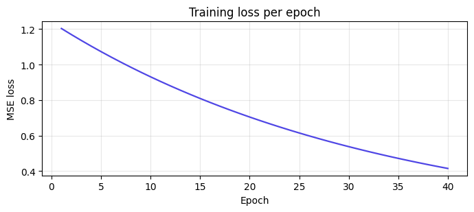

# Tiny training loop

> Source: [`notebooks/train.py`](../notebooks/train.py) · last run `2026-04-18T16:08:03+00:00`

A one-parameter linear regression fit with gradient descent, plus a
loss curve and final metrics. Every run dumps:

- `artifacts/checkpoint.json` — the final weight + full loss history.
- `artifacts/metrics.json` — end-of-training summary (for the tearsheet table).
- `artifacts/loss_curve.png` — training loss vs. epoch.

**Config**

```python
EPOCHS = 40
LR = 0.02
SEED = 0
TRUE_W = 1.7
NOISE = 0.25
```




**Metrics**

| field | value |
| --- | --- |
| `epochs` | `40` |
| `learning_rate` | `0.02` |
| `final_weight` | `0.7903` |
| `target_weight` | `1.7` |
| `final_loss` | `0.4149` |
| `initial_loss` | `1.203` |
| `weight_error_abs` | `0.9097` |


**Checkpoint**

| field | value |
| --- | --- |
| `weight` | `0.7903` |
| `history` | `[40 items]` |


---

*Generated by `jellycell export tearsheet notebooks/train.py`. Edit freely — regenerate any time.*
