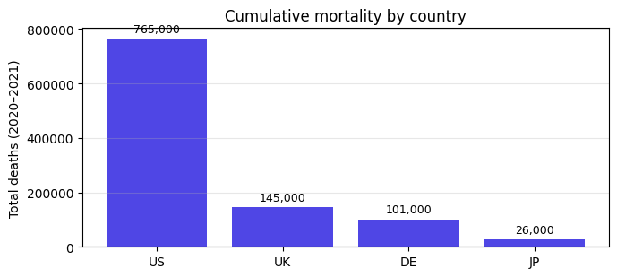
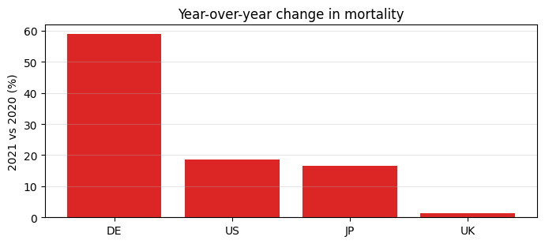

# Mortality trends (paper draft)

A minimal manuscript showing how a jellycell project layers a hand-authored
writeup (this file) on top of an auto-generated [tearsheet](tearsheet.md).
Both reference the same `artifacts/` tree; edits to the notebook flow
through to the tearsheet automatically while this narrative stays under the
author's control.

## Background

Synthetic two-year mortality counts for four countries — just enough data
to exercise aggregations, year-over-year comparisons, and a couple of
figures inside a jellycell dep graph.

## Methods

Compute lives in [`notebooks/analysis.py`](../notebooks/analysis.py):

- The `raw` cell reads [`data/sample.csv`](../data/sample.csv).
- `per_country_totals` aggregates deaths per country.
- `yoy_change` computes 2020→2021 percent change where both years are present.
- `country_totals` and `yoy_chart` render the two figures below.
- `summary` persists a compact JSON digest to [`artifacts/summary.json`](../artifacts/summary.json).

Jellycell's dep graph keeps the figures fresh: changing a single row in
`data/sample.csv` invalidates only the subgraph that depends on it.

## Results — totals



US accounts for ~74% of the combined total across the sample. The full
country → total table lives in [`artifacts/totals.json`](../artifacts/totals.json).

## Results — year-over-year



Germany shows the largest 2021-over-2020 increase at roughly +59%. UK is
nearly flat; JP and US both rise moderately.

## Reproducibility

```bash
cd examples/paper
jellycell run notebooks/analysis.py
jellycell export tearsheet notebooks/analysis.py -o manuscripts/tearsheet.md
jellycell render                                    # HTML catalogue
```

Every cell is content-addressed — the second `run` is all cache hits.
Swap `data/sample.csv` for a real dataset and only the affected subgraph
re-executes.
