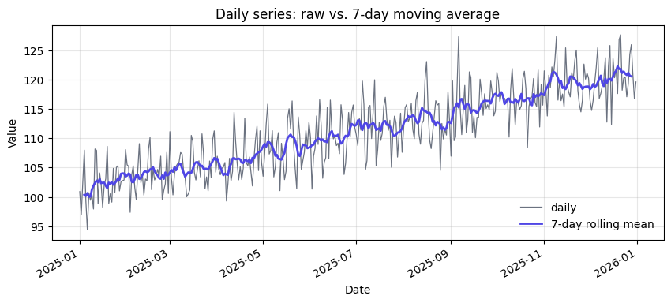
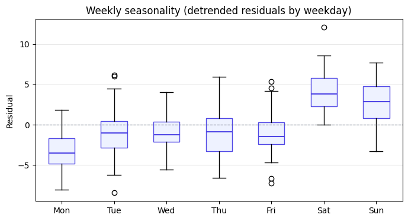

# Explore — daily time series

> Source: [`notebooks/01-explore.py`](../notebooks/01-explore.py) · last run `2026-04-18T06:20:40+00:00`

A self-contained tour of:

- Generating a synthetic daily series with trend + weekly seasonality + noise.
- Running summary statistics.
- Plotting raw values vs. a 7-day rolling mean.
- Persisting cleaned data as a Parquet artifact for downstream notebooks.

**Summary**

| field | value |
| --- | --- |
| `rows` | `365` |
| `mean` | `111.1` |
| `std` | `6.953` |
| `min` | `94.37` |
| `max` | `127.7` |
| `start` | 2025-01-01 |
| `end` | 2025-12-31 |

---

*Generated by `jellycell export tearsheet notebooks/01-explore.py`. Edit freely — regenerate any time.*
