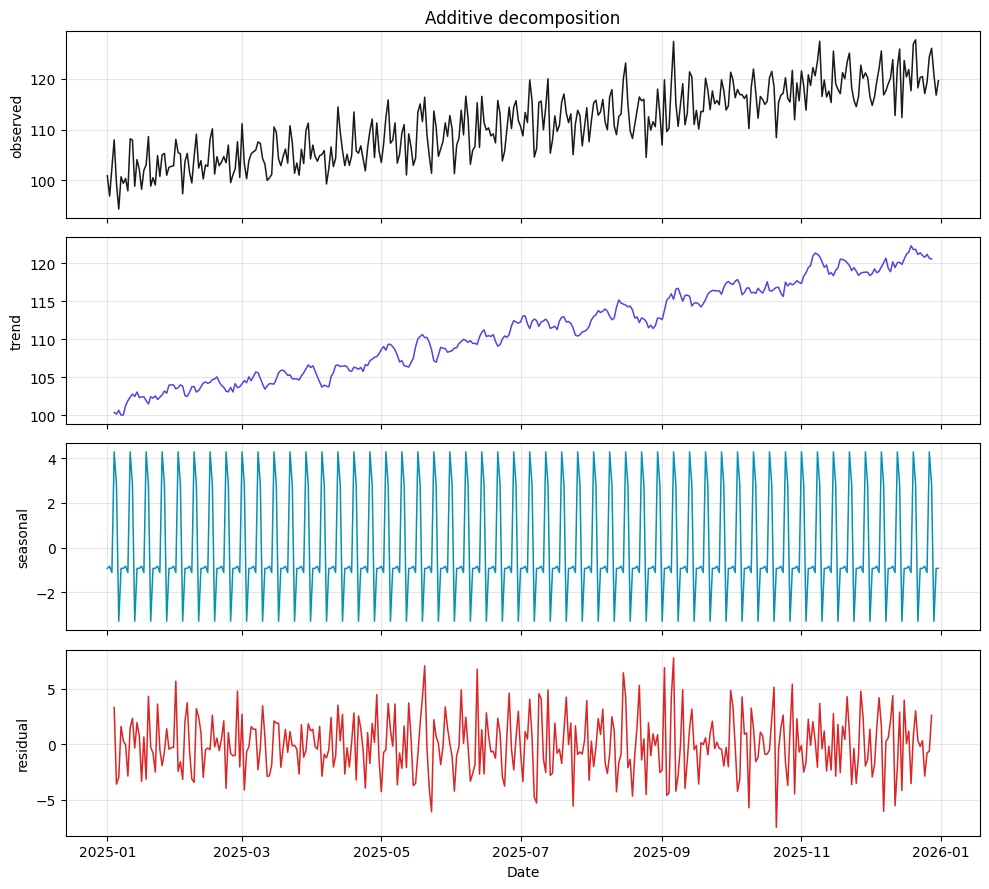

# Decompose — trend, seasonality, residuals

> **Tearsheet** for [`notebooks/02-decompose.py`](../../notebooks/02-decompose.py) · [HTML report](../../site/02-decompose.html) · last run `2026-04-18T19:02:22+00:00`

Loads the Parquet artifact from `01-explore.py`, splits the series into
three components using classical additive decomposition:

\[ y_t = T_t + S_t + R_t \]

where the trend `T` is a centered 7-day rolling mean, the seasonality `S` is
the average detrended value by weekday, and the residual `R` is whatever's
left. All three are persisted as artifacts.

---

*Auto-generated by `jellycell export tearsheet notebooks/02-decompose.py`. Regenerating overwrites this file — for hand-authored writeups put a `.md` at the root of `manuscripts/` instead of under `tearsheets/`.*
