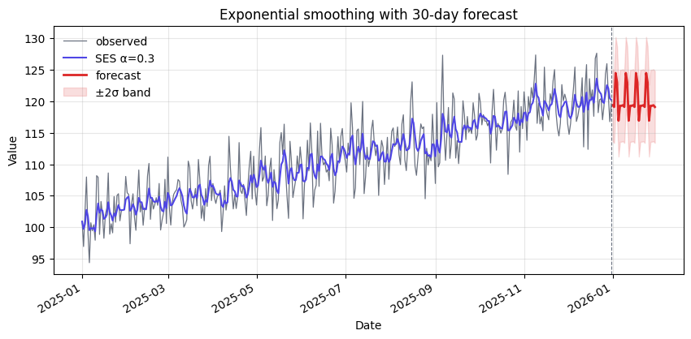
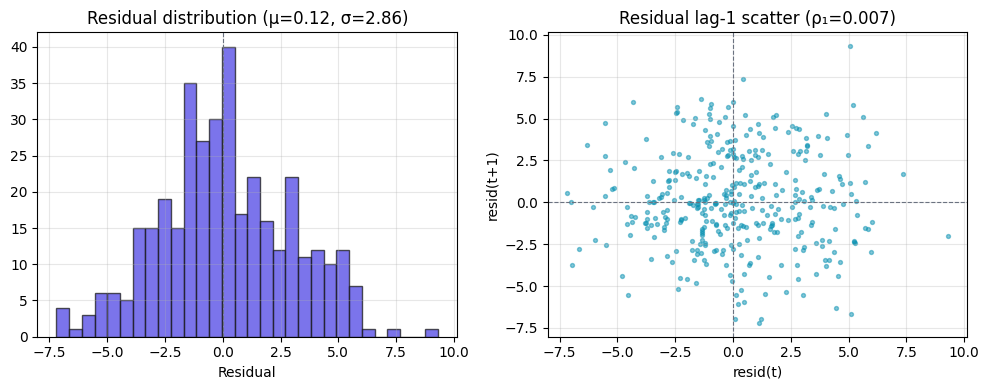

# Forecast — exponential smoothing + diagnostics

> **Tearsheet** for [`notebooks/03-forecast.py`](../../notebooks/03-forecast.py) · [HTML report](../../site/03-forecast.html) · last run `2026-04-18T19:02:24+00:00`

Loads the decomposition, fits a simple exponential smoothing (level-only)
with $\alpha = 0.3$, projects 30 days ahead, and checks residual whiteness
via a histogram + lag-1 autocorrelation.

**Report**

| field | value |
| --- | --- |
| `alpha` | `0.3` |
| `in_sample.mae` | `2.25` |
| `in_sample.rmse` | `2.856` |
| `residuals.mean` | `0.123` |
| `residuals.std` | `2.858` |
| `residuals.lag1` | `0.007` |
| `forecast_horizon_days` | `30` |
| `forecast_range.first` | 2026-01-01 |
| `forecast_range.last` | 2026-01-30 |

---

*Auto-generated by `jellycell export tearsheet notebooks/03-forecast.py`. Regenerating overwrites this file — for hand-authored writeups put a `.md` at the root of `manuscripts/` instead of under `tearsheets/`.*
